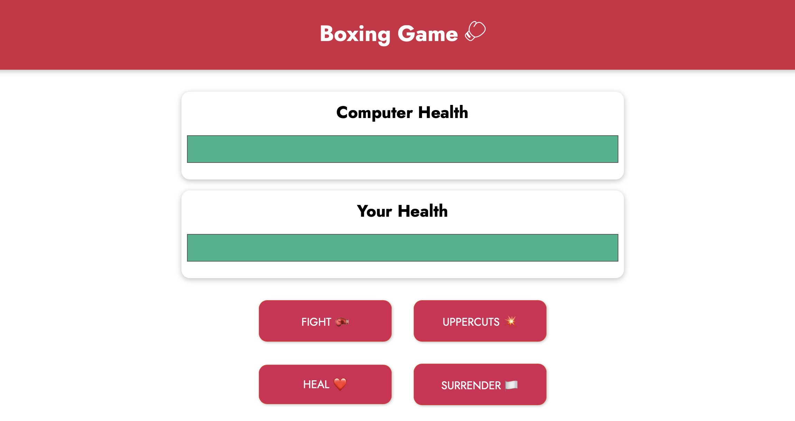

  <h1 align="center"> Vue.JS - Boxing Game 🧑‍💻</h1>
<h2 style="">Goal:</h2>
  <ul>
  <li>

v-if | v-on | v-model | methods | data | v-for | v-show | v-bind

  </li>
  <li>
  Practicing data / methods / styling
  </li>
    
   </ul>

  

    Screenshot:
  

  

## Requirements

- Vue 3

## Font

- Jost

## Main Part

`Boxing Game`

# Installation

No need to install any application, just open it via your browser and enjoy it!
